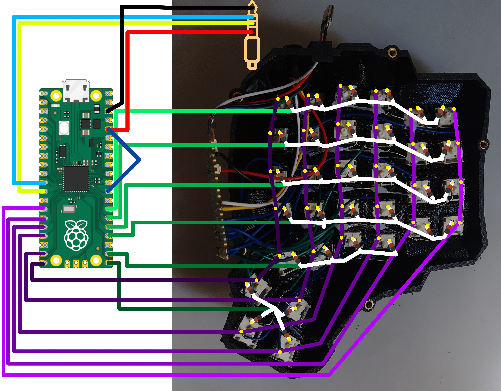
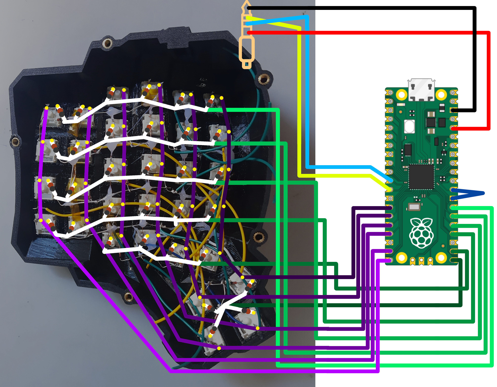

# dactyl_manuform_pi_pico


## Intro

This is a dactyl_manuform on Raspberry Pi Pico guide.

### Vial

Here is vial firmware fork, which allows hot-configuration of keymaps via [vial.rocks](https://vial.rocks) https://github.com/GustawXYZ/vial-qmk/tree/vial
Once [handwired/dactyl_manuform_pi_pico ](https://github.com/vial-kb/vial-qmk/pull/889) is merged firmware will be available at the official https://github.com/vial-kb/vial-qmk/tree/vial/keyboards/handwired/dactyl_manuform_pi_pico repository.

### QMK

Firmware availabe at official QMK repository: https://github.com/qmk_firmware/qmk_firmware/tree/master/keyboards/handwired/dactyl_manuform_pi_pico

## Build




I strived to make soldering as similar as possible to dactyl_manuform guide.

[abstracthat/dactyl-manuform](https://github.com/abstracthat/dactyl-manuform)

Switched connections:

|ProMicro|PiPico|
|-|-|
|4|GP10|
|5|GP11|
|6|GP12|
|7|GP13|
|8|GP14|
|9|GP15|
|A1|GP21|
|A0|GP20|
|15|GP19|
|14|GP18|
|16|GP17|
|10|GP16|

I used a 4 pin jack 3.5mm connection. It uses SERIAL_USART_FULL_DUPLEX (whatever that means).

Connections are as following:

|Left PiPico|Right PiPico|
|-|-|
|3V3|3V3|
|GND|GND|
|GP9|GP8|
|GP8|GP9|

GP8 and GP9 are switch in "X" pattern, so that TX and RX are switched on the other board.

For the keyboard to be able to tell the right side from the lefts - it needs two jumpers to set the `SPLIT_HAND_PIN`:

|Side|Jumper from|to|
|-|-|-|
|Left|GP22|3V3|
|Right|GP22|GND|

## Flashing firmware

### Vial

First do the setup `qmk` from QMK section.

Then clone my fork somewhere that is NOT ~/qmk_firmware, e.g. `git clone https://github.com/GustawXYZ/vial-qmk/ ~/vial-qmk`

Then `cd ~/vial-qmk` `make git-submodule` and `make handwired/dactyl_manuform_pi_pico:vial`

If the build fails try `make claen` and `rm -r lib/*` (https://github.com/qmk/qmk_firmware/issues/15125)

If this succeeds you will have ready firmware in .build folder.

To flash, open .build folder in your file editor of choice, and set your keyboard into bootloader mode by holding the RESET button and plugging in the USB. After that you can open the new "drive" that should be called something like RPI-PICO, and drag `.build/handwired_dactyl_manuform_pi_pico_default.uf2` to the new drive. This should flash the keyboard and automatically unmount it. Wait a few seconds and repeat for other half (with the same .uf2 file)

### QMK

You need to set up `qmk` toolchain as per here: https://docs.qmk.fm/#/newbs_building_firmware

and run to make sure qmk is up and working.
```
qmk setup
```

Next proceed with the following commands for a simple update/flash:

```bash
cd ~/qmk_firmware/keyboards/handwired/dactyl_manuform_pi_pico/keymaps/default &&
qmk flash
```
This should build the firmware and try flashing it.
When qmk says "waiting for drive" unplug your keyboard, then plug it back again while holding RESET button on the Pi Pico.
It should show up in your file manager, if needed mount it e.g. by clicking on it in Thunar File Manager.
QMK then should automatically pick it up and complete.

## With QMK Configurator

This will be only available after the fork is merged.

1. Go to [QMK Configurator](config.qmk.fm/)
1. Create you keymap
1. Download the .json
1. run `qmk flash my-file.json`
1. When qmk says waiting for the drive, unplug your keyboard, plug it while holding RESET and mount the drive (repeat for other half)
